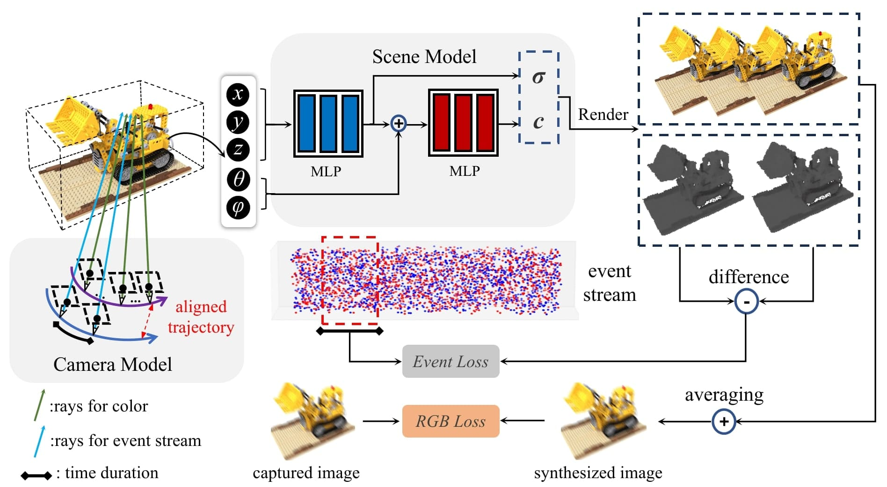

<h1 align="center">BeNeRF: Neural Radiance Fields from a Single Blurry Image and Event Stream</h1>

    <a href="https://akawincent.github.io">Wenpu Li</a>1,5* &emsp;&emsp;
    <a href="https://github.com/pianwan">Pian Wan </a>1,2* &emsp;&emsp;
    <a href="https://wangpeng000.github.io">Peng Wang</a>1,3* &emsp;&emsp;
    <a href="https://jinghangli.github.io/">Jinghang Li</a>4 &emsp;&emsp;
    <a href="https://sites.google.com/view/zhouyi-joey/home">Yi Zhou</a>4 &emsp;&emsp;
    <a href="https://ethliup.github.io/">Peidong Liu</a>1†

    *equal contribution &emsp;&emsp; † denotes corresponding author.

    1Westlake University &emsp;&emsp;
    2EPFL &emsp;&emsp;
    3Zhejiang University &emsp;&emsp;
    4Hunan University &emsp;&emsp;  
    5Guangdong University of Technology 

<h5 align="center"> This paper was accepted by European Conference on Computer Vision (ECCV) 2024.</h5>
<h5 align="center"> If you like our project, please give us a star ⭐ on GitHub for the latest update.</h5>

<h5 align="center">

 
 
 

</h5>

This repository is an official PyTorch implementation of the paper "BeNeRF: Neural Radiance Fields from a Single Blurry Image and Event Stream". We explore the possibility of recovering the neural radiance fields and camera motion trajectory from a single blurry image. This allows BeNeRF to decode the underlying sharp video from a single blurred image.

## 📢 News
- `2024.08.20` Training Code and datasets have been released. 
- `2024.07.01` Our paper was accepted by ECCV2024!! Thanks to all collaborators!!

## 📋 Overview

Given a single blurry image and its corresponding event stream, BeNeRF recovers the underlying 3D scene representation and the camera motion trajectory jointly. In particular, we represent the 3D scene with neural radiance fields and the camera motion trajectory with a cubic B-Spline in SE(3) space. Both the blurry image and accumulated events within a time interval can thus be synthesized from the 3D scene representation providing the camera poses. The camera trajectory, NeRF, are then optimized by minimizing the difference between the synthesized data and the real measurements.

## Result

## Quickstart

## Citation

## Acknowledgment

The overall framework, metrics computing and camera transformation are derived from [nerf-pytorch](https://github.com/yenchenlin/nerf-pytorch/), [BAD-NeRF](https://github.com/WU-CVGL/BAD-NeRF) respectively. We appreciate the effort of the contributors to these repositories.
