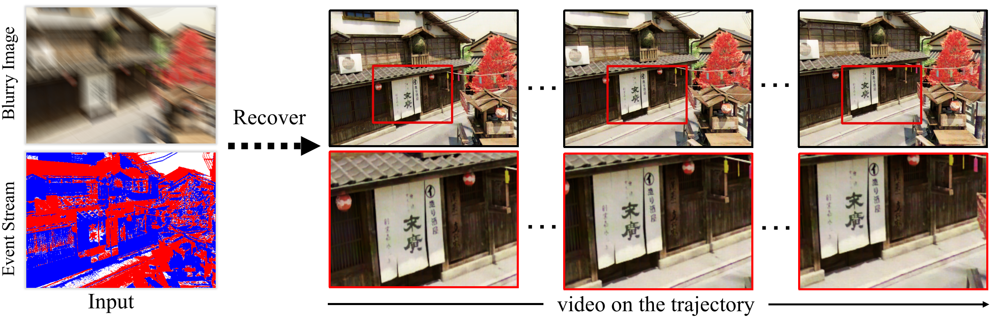

# BeNeRF

This is an official PyTorch implementation of the paper [BeNeRF: Neural Radiance Fields from a Single Blurry Image and Event Stream](https://arxiv.org/abs/2407.02174v2) (ECCV 2024). Authors: [Wenpu Li*](https://github.com/akawincent), [Pian Wan*](https://github.com/pianwan), [Peng Wang*](https://github.com/wangpeng000), [Jinghang Li](https://scholar.google.com/citations?user=csfnTk4AAAAJ), [Yi Zhou](https://scholar.google.com.au/citations?user=_21IqnsAAAAJ) and [Peidong Liu](https://ethliup.github.io/).

\* denots equal contribution.

## ✨News

## Result

## Method overview

## Quickstart

## Citation

## Acknowledgment
The overall framework, metrics computing and camera transformation are derived from [nerf-pytorch](https://github.com/yenchenlin/nerf-pytorch/), [BAD-NeRF](https://github.com/WU-CVGL/BAD-NeRF) respectively. We appreciate the effort of the contributors to these repositories.